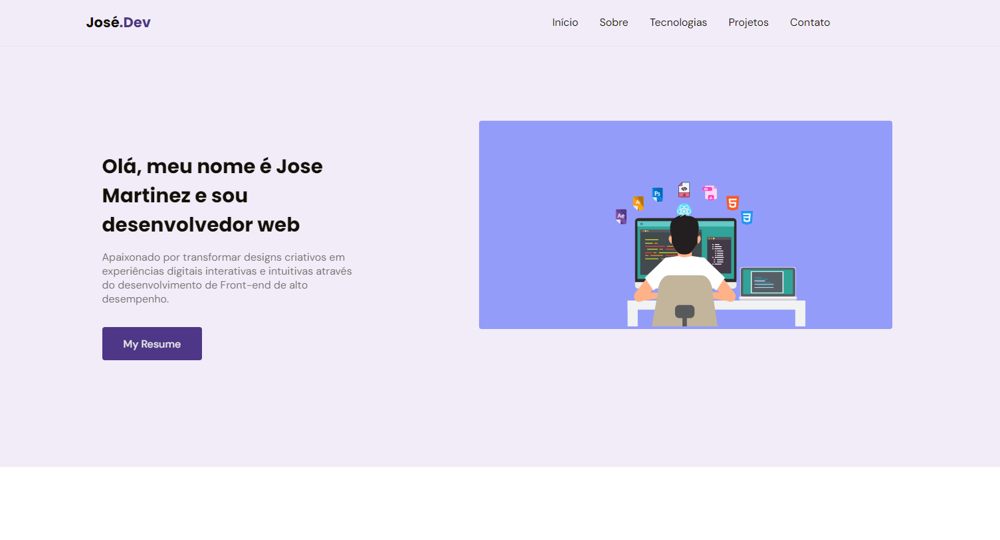

# My Portfolio V.1

Esta seria a primeira versão de Meu Portfolio onde vou
adicionar as Stacks que estou estudando e as que domino, os
projetos pessoais e os que estou aplicando como caso de estudo.
Assim como a seção de contato para propostas de trabalho 
ou de estudo. 

## Link da aplicação

👉🏼[Clique aqui para accessar](https://my-portfolio-jose-martinez.netlify.app/)

##  Tecnologias usadas no projeto

## 🔗 Deploy 

## 💻 Sobre mim 😄
Entusiasta da programação e estudante de Engenharia de Software com foco em desenvolvimento front-end rumo ao full stack. Dedicado a criar experiências digitais inovadoras que impactam o mundo através da tecnologia.

## 🔗 Contato 

## Referências 🚀

 - [Rocketseat](https://app.rocketseat.com.br/cart/rocketseat-one?referral=jose-manuel-06853&utm_source=platform&utm_medium=organic&utm_campaign=venda&utm_term=mgm&utm_content=indication-lp_one)
 - [MDN Web Docs](https://developer.mozilla.org/es/)